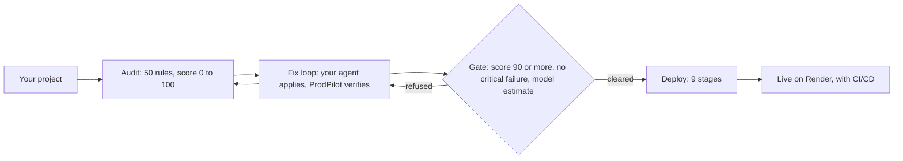

# ProdPilot

**Takes a web app you built with an AI coding assistant from "it works on my machine" to a live, verified deployment, without leaving your IDE.**

[](https://github.com/prodpilotai/ProdPilot/actions/workflows/tests.yml)
[](pyproject.toml)
[](LICENSE)
[](CHANGELOG.md)

AI coding assistants make it quick to build a Node.js API or a React app that
runs on your laptop. Getting it to run in production is where it breaks:
credentials hardcoded in the source, no security headers, no container setup,
no health check, and a deploy that fails with an error you have never seen.

ProdPilot finds those gaps, has your IDE's own coding agent fix them one at a
time, checks every fix itself, and deploys the project to Render with a CI/CD
pipeline once it is ready. It works as a Model Context Protocol (MCP) server: a
small program on your machine that the agent in VS Code with GitHub Copilot,
Cursor or Devin can call as a set of tools. ProdPilot calls no AI service
itself.

It is for developers building **Node.js with Express** APIs or **React with
Vite** apps who want them deployed properly, not just deployed.

## Features

- **A production audit of 50 rules** across security, secrets, environment,
  build, connectivity, API, structure, observability and git hygiene, scored
  from 0 to 100.
- **Fixes your agent applies and ProdPilot verifies.** The agent reports a
  fix; ProdPilot re-runs that rule's own check on your files and decides. A fix
  that breaks something that already worked is undone.
- **Predictable changes.** 44 of the 50 rules come with an exact change for the
  agent to apply; only 6 ask it to write code, inside limits ProdPilot sets.
- **A gate that asks whether it will really deploy.** A score of at least 90,
  no critical failures, and an estimate from a model trained on 684 real Render
  deployments.
- **Deployment in one call.** Nine stages, from a local Docker build to a live,
  smoke tested Render service with a GitHub Actions pipeline. It stops at the
  first stage that fails and tells you why.
- **Your credentials stay yours.** They live in a file only your account can
  read, never in the project, and repository secrets are encrypted before they
  leave your machine.
- **Works in the IDE you already use.** One command connects VS Code, Cursor or
  Devin, formerly Windsurf.

## Quick start

You need Python 3.11 to 3.14, Node.js 20 or later, Docker running, git, a
GitHub token and a Render API key.

```bash
pipx install prodpilot          # 1. install
prodpilot setup                 # 2. store your GitHub token and Render API key
prodpilot connect vscode        # 3. connect your IDE: vscode, cursor, or devin --project PATH
```

1.0.0rc2 is the current release and it is a release candidate, so the command
above installs it. To pin it, ask for `prodpilot==1.0.0rc2`.

Then check that everything ProdPilot needs is in place:

```bash
prodpilot doctor
```

```text
ProdPilot doctor

Config file: ~/.prodpilot/config.toml
  found
  github_token: stored
  render_api_key: stored
  permissions: access is limited to the current user

Tools ProdPilot runs:
  git: git version 2.54.0.windows.1
  Node.js: v26.3.0
  Docker: daemon 29.7.2

All checks passed.
```

In VS Code, run **MCP: List Servers** and start `prodpilot`. Open your project
and ask the agent:

> Use ProdPilot to audit this project and fix what it reports, one rule at a time.

## Installation

| Method | Command |
| --- | --- |
| pipx, recommended | `pipx install prodpilot` |
| uv | `uv tool install prodpilot` |
| pip | `pip install prodpilot` |
| From source | `git clone https://github.com/prodpilotai/ProdPilot && cd ProdPilot && pip install .` |

`pip install prodpilot` works and is the shortest route. pipx and uv are
recommended because ProdPilot is a command line tool: they keep it and its
dependencies in their own environment, so it cannot clash with the packages of
whatever project you are working on.

Check the install with `prodpilot --help`, which lists `serve`, `setup`,
`doctor` and `connect`.

| Requirement | Why |
| --- | --- |
| Python 3.11, 3.12, 3.13 or 3.14 | ProdPilot itself |
| Node.js 20 or later | The audit parses your JavaScript with Node |
| Docker, running | The gate and the deploy build your project in a container first |
| git, and a GitHub repository set as the project's `origin` | Deploys push the files ProdPilot generated |
| A GitHub token | A classic token with the `repo` and `workflow` scopes, or a fine grained one with read and write access to contents, secrets and workflows |
| A Render account and API key | Render is where the project is deployed |

ProdPilot is developed and tested on Windows 11, and the repository's test
workflow is configured for Linux and macOS.

## Usage

### Audit and fix

> Use ProdPilot to audit this project and fix what it reports, one rule at a
> time, reporting each fix with prodpilot_fix_applied.

The agent asks ProdPilot for the exact change each failing rule needs, applies
it, and reports back. ProdPilot re-runs the rule's check and answers
`resolved`, `unresolved` or `blocked`, whatever the agent claimed. On one of
the deliberately broken sample projects in this repository, the first audit
scores 13 out of 100 with 6 critical failures; after the fix loop it scores 96
with none.

### Deploy

Commit your changes, then:

> Deploy this project with prodpilot_deploy.

The deploy creates a real Render service on the free plan and pushes to your
GitHub repository, so the agent is told to confirm with you first. You get a
live URL and a GitHub Actions workflow that redeploys on every push and checks
the service afterwards. A small Express API that the fix loop took from 69 to
100 went live on Render this way, all nine stages passing, in 82 seconds.

### When something is refused

ProdPilot always says which condition failed. These are real messages:

```text
score 89 but 1 critical rule(s) still fail: SEC-003
score 99 meets the threshold, but the model estimates a 5% chance of deploying, below its operating point of 37%
build failed, missing dependency: npm error The `npm ci` command can only install with an existing package-lock.json or
```

## Tools and commands

The five tools your IDE's agent sees:

| Tool | What it does |
| --- | --- |
| `prodpilot_ping` | Confirms the server is running |
| `prodpilot_detect_stack` | Identifies the project's stack and returns what a production-ready version must contain |
| `prodpilot_fix_instruction` | Returns the exact change, or the limits for the change, that fixes one failing rule |
| `prodpilot_fix_applied` | Takes the agent's report of a fix and answers from the rule's own check |
| `prodpilot_deploy` | Runs the nine deploy stages; creates a real Render service and pushes to GitHub |

The commands you run:

| Command | What it does |
| --- | --- |
| `prodpilot setup` | Stores the GitHub token and Render API key in `~/.prodpilot/config.toml`, readable only by you |
| `prodpilot doctor [--project PATH]` | Checks the credentials, git, Node.js and Docker; with `--project`, that the project's state file is kept out of git |
| `prodpilot connect vscode\|cursor\|devin [--project PATH]` | Adds ProdPilot to that IDE's configuration; `--project` is for Devin, which is set up per project |
| `prodpilot serve` | Starts the MCP server over stdio; your IDE runs this for you |

## How it works



Each rule has its own check, and a fix only counts when that check passes on
the files on disk. Each rule gets three attempts, and the loop runs up to five
times while the gate stays shut. The deploy stages are pre-flight checks,
environment sealing, a local Docker build and run, a push of the generated
files, the Render deployment, deploy monitoring, a smoke test of the live
service, and CI/CD wiring. The design, the model and the data behind it are in
[docs/architecture.md](docs/architecture.md).

## Privacy and security

- ProdPilot talks only to GitHub, Render, and, while building your project,
  Docker Hub and the npm registry. It sends no telemetry.
- Your GitHub token and Render API key are stored outside every project, in a
  file restricted to your account.
- Secrets go to the test container at run time, never into the image, and to
  GitHub encrypted with your repository's public key.

Report a vulnerability privately as described in [SECURITY.md](SECURITY.md).

## Limitations

- Two stacks only: Node.js with Express, and React with Vite.
- One deployment target: Render, on its free plan.
- For the 6 rules where the agent writes the change, how often a live agent's
  change passes on the first try has not been measured yet.
- A project whose code requires a file it does not contain can pass the audit;
  the Docker build during the deploy catches it and names the missing module.
- Render's own automatic deploy stays on, so a push can start a second deploy
  beside the workflow's; the workflow waits for the newer one.
- This is a beta. Not yet observed on real services: a deploy started by an IDE
  agent, the generated workflow running on GitHub Actions, and `prodpilot
  connect` inside Cursor and Devin.

## What's new in the first release candidate

- The deployability model ships inside the package.
- `prodpilot connect` sets up VS Code, Cursor and Devin in one command.
- `prodpilot doctor` checks git, Node.js and Docker.
- The generated CI/CD workflow waits for its own deploy before checking the
  service.
- Runs on Python 3.11 to 3.14.

The full list is in [CHANGELOG.md](CHANGELOG.md).

## Documentation

- [Quick start and troubleshooting](docs/quickstart.md)
- [Architecture: the audit, the fix loop, the gate, the model and the data](docs/architecture.md)
- [IDE compatibility, observed in each client](docs/compatibility.md)
- [The whole chain run on every sample project](docs/pipeline.md)
- [Measured fix reliability](docs/metrics.md)
- [The deployability model's evaluation](docs/evaluation.md)

## Contributing

```bash
git clone https://github.com/prodpilotai/ProdPilot
cd ProdPilot
python -m venv .venv
.venv/bin/pip install -e . --group dev     # on Windows: .venv\Scripts\pip; needs pip 25.1 or later
.venv/bin/python -m pytest
```

The tests reach no live service: Render and GitHub are scripted. Tests that
build real Docker images are skipped when no Docker daemon is running. Please
open an issue before a large change, and run the suite before sending a pull
request.

Questions and bug reports go to
[GitHub issues](https://github.com/prodpilotai/ProdPilot/issues).

## License

MIT, see [LICENSE](LICENSE). Bundled third-party code is listed in
[THIRD_PARTY_NOTICES.md](THIRD_PARTY_NOTICES.md).

## Credits

Built by Muhammad Sudais Khalid, Muhammad Farooq Khan and Muhammad Talha Khan
as the Final Year Project BSAI-FYP-2026 of the Department of Artificial
Intelligence, Shifa Tameer-e-Millat University, at the Artificial Intelligence
Technology Centre, National Centre for Physics, Islamabad. Supervised by Mr.
Rehan Naveed Abbasi, with industrial supervision by Dr. Rana Fayyaz Ahmad and
Muhammad Junaid Asif.
